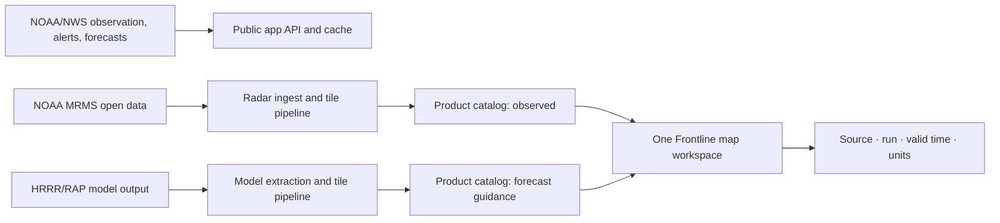

# Radar integration plan

## Product contract

Frontline Forecast uses one map workspace for two distinct questions:

- **Observed** — what has happened or is happening now: radar, satellite, lightning, and active hazards.
- **Forecast guidance** — what a named forecast system expects next: precipitation, wind, temperature, and eventually model precipitation or simulated reflectivity.

Observed data and model output must never share the same unqualified label. A model product will always show its model name, run time, valid time, units, and the words **forecast guidance** or **simulated reflectivity**. It is not to be called “radar.”

## Current release

The public radar workspace now provides:

- NOAA/NWS composite reflectivity as the live observed fallback.
- A past-frame timeline using the current RainViewer pilot source.
- NOAA GOES-East GeoColor satellite imagery.
- NWS alert polygons that can be switched on or off.
- NWS National Digital Forecast Database (NDFD) fields for precipitation chance, wind speed, and high temperature.

The UI deliberately separates **Observed** and **Forecast guidance** before a user selects a product. The map does not overlay forecast fields on observed reflectivity by default.

## Integration architecture



The public app should request a compact product manifest rather than know provider-specific URLs. A future manifest will include:

```ts
type RadarProduct = {
  id: string;
  family: "observed" | "forecast";
  label: string;
  source: string;
  runTime?: string;
  validTime?: string;
  units?: string;
  tileTemplate: string;
  expiresAt: string;
};
```

## Delivery phases

### 1. Interaction foundation — complete in this release

Keep observed and forecast products separate, retain simple map controls, show status and provenance, and preserve the current no-cost sources as a pilot implementation.

### 2. Observed-radar ownership

Use the NOAA MRMS public dataset as the primary observed-radar feed. A small ingest service should fetch only the desired products and frames, convert them to web tiles or Cloud Optimized GeoTIFFs, write a short-retention manifest, and serve them through a CDN. Keep 2–6 hours of frames for playback; expire intermediate files automatically.

Before this phase ships, validate coverage, latency, rate limits, caching, attribution, outages, and the operational cost of storage and egress. RainViewer remains a fallback only while its terms allow the intended use.

### 3. Model-map foundation

Start with HRRR precipitation-rate or accumulated precipitation fields. Produce map tiles per model run and valid time, then add a timeline that moves forward from a clearly marked run time. Do not ship simulated reflectivity until the conversion and meteorological review criteria are agreed upon.

Each product must include:

- model and run time;
- valid time and timezone;
- units and color scale;
- source / attribution;
- availability and expiry state;
- plain-language distinction from observed radar.

### 4. Simulated reflectivity

Evaluate HRRR/RAP reflectivity products after the underlying pipeline is stable. Treat this as an experimental forecast aid first: compare it against observations, collect internal forecaster feedback, define a confidence presentation, and document known failure modes. It should never be presented as a literal future radar image.

### 5. Commercial-grade imagery decision

Before revenue, compare a commercial imagery provider with the self-managed MRMS path using written commercial rights, coverage, update cadence, SLA, map tile terms, total cost, and exit path. The Weather Company is a candidate to quote; no provider should be adopted based on visual quality alone.

## Gates before commercial launch

1. Written rights for every public map layer, basemap, icon, and data source.
2. Provider register in Company HQ: owner, renewal date, recovery contact, terms link, data-use tier, and cost.
3. Source-specific cache, outage, and fallback behavior tested.
4. Observed and forecast labels reviewed at desktop and mobile sizes.
5. Accessibility review: keyboard navigation, contrast, non-color status text, and screen-reader map labels.
6. Load test at expected traffic and audit of third-party requests.
7. Incident procedure for stale, missing, or contradictory imagery.

## Recommended next engineering work

1. Add a product-manifest API and data freshness status to replace provider-specific browser assumptions.
2. Prototype MRMS ingest outside the public request path and measure actual tile/storage cost.
3. Add model-run metadata and a forecast timeline before adding any model radar-like product.
4. Review commercial rights for OpenWeather, RainViewer, OpenStreetMap tile usage, and all future imagery providers.
5. Add an HQ radar-provider record with renewal, owner, permitted use, operational health, and contingency fields.
